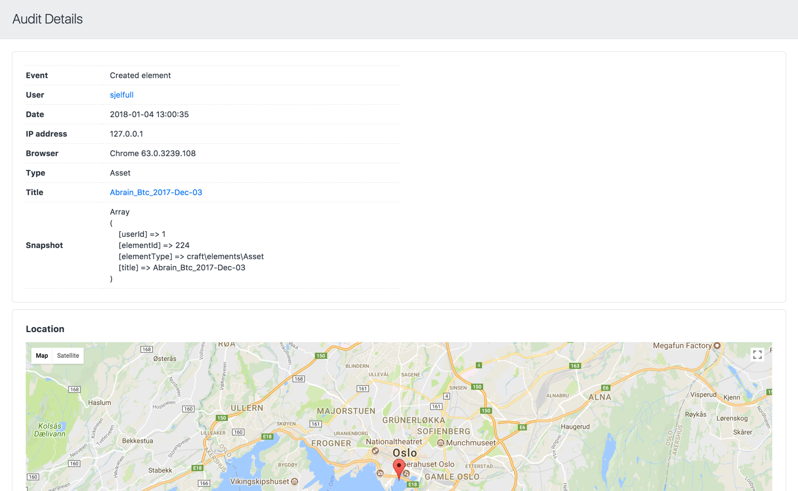
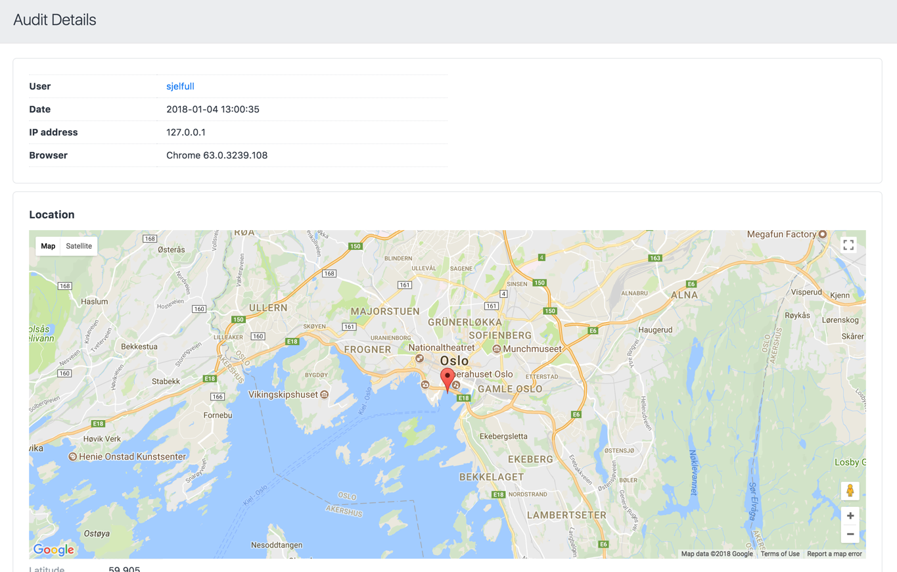

# Audit plugin for Craft CMS 3.x

Audit log for Craft 3.


_Note: This plugin will cost $99.00 once Craft 3 GA is released._

## Screenshots





## Requirements

This plugin requires Craft CMS 3.0.0-beta.23 or later.

## Installation

To install the plugin, follow these instructions.

1. Open your terminal and go to your Craft project:

        cd /path/to/project

2. Then tell Composer to load the plugin:

        composer require superbig/craft-audit

3. In the Control Panel, go to Settings → Plugins and click the “Install” button for Audit.

## Audit Overview

Audit automatically keeps a audit log for actions done by logged in users.

## Configuring Audit

```php
<?php
return [
    // How many days to keep log entries around
    'pruneDays'          => 30,

    // Enable logging
    'enabled'            => true,

    // Enable geolocation status
    'enabledGeolocation' => true,
];
```

## Using Audit

As long as the plugin is installed, it will log the following events automatically:

- Creating/saving/deleting elements (including users, Commerce product/variants etc.)
- Creating/saving/deleting routes
- Installing/uninstalling and enabling/disabling plugins
- Login/logout

More events like Commerce-specific event handling is planned.

## Clearing old records

You can prune records older than `n` days (configured by the `pruneDays` setting) either by using the console command `./craft audit/default/prune-logs` or by a button on the Audit index screen. 

## Credits

- [Auditing icon by Ralf Schmitzer](https://thenounproject.com/term/auditing/960985)

Brought to you by [Superbig](https://superbig.co)
