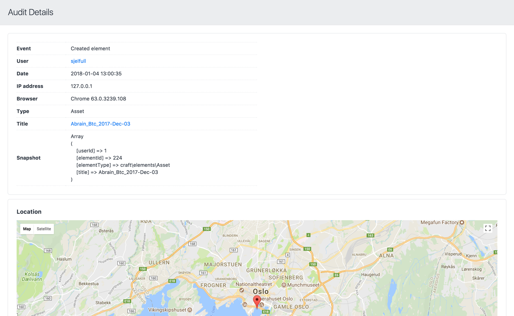

# Audit plugin for Craft CMS 5

Enterprise-grade audit logging for Craft CMS. Track every change, login, and system event — then send your logs anywhere.


_$99.00 through the [Craft Plugin Store](https://plugins.craftcms.com/audit) for production use._


## What It Does

Audit automatically logs actions performed by authenticated users:

- **Content** — Creating, saving, and deleting entries, assets, users, globals, and Commerce products/variants
- **Users** — Logins, logouts, account activation/deactivation, suspension, locking, group assignments
- **Permissions** — User and group permission changes
- **Schema** — Field, section, and entry type changes
- **System** — Plugin installs/uninstalls, route changes, database backups/restores, settings changes

No configuration required — install the plugin and logging starts immediately.

## Requirements

- Craft CMS 5.5+
- PHP 8.2+

## Installation

```bash
cd /path/to/project
composer require superbig/craft-audit
```

Then go to **Settings → Plugins** in the Control Panel and click **Install** for Audit.

## Screenshots




---

## Configuration

Create a `config/audit.php` file to customize behavior:

```php
<?php

return [
    // How many days to keep log entries (default: 30)
    'pruneDays' => 30,

    // Master switch for logging
    'enabled' => true,

    // Toggle event categories
    'logElementEvents'       => true,
    'logChildElementEvents'  => false,
    'logDraftEvents'         => false,
    'logPluginEvents'        => true,
    'logUserEvents'          => true,
    'logRouteEvents'         => true,
    'logUserSecurityEvents'  => true,
    'logPermissionEvents'    => true,
    'logSchemaEvents'        => true,
    'logDatabaseEvents'      => true,

    // Auto-prune on admin CP requests
    'pruneRecordsOnAdminRequests' => false,

    // Geolocation (requires MaxMind license)
    'enabledGeolocation' => true,
    'maxmindAccountId'   => '',
    'maxmindLicenseKey'  => '',
    'dbPath'             => '',
];
```

This file supports [multi-environment config](https://craftcms.com/docs/5.x/configure.html#multi-environment-configs), so you can have different settings per environment.

### Event Categories

| Setting | What It Logs | Default |
|---------|-------------|---------|
| `logElementEvents` | Entry/asset/user create, save, delete | `true` |
| `logChildElementEvents` | Child element changes (e.g., Matrix blocks) | `false` |
| `logDraftEvents` | Draft creation and saves | `false` |
| `logPluginEvents` | Plugin install, uninstall, enable, disable | `true` |
| `logUserEvents` | Login, logout | `true` |
| `logRouteEvents` | Route create, save, delete | `true` |
| `logUserSecurityEvents` | Account activate, deactivate, suspend, lock | `true` |
| `logPermissionEvents` | User/group permission changes | `true` |
| `logSchemaEvents` | Field, section, entry type changes | `true` |
| `logDatabaseEvents` | Database backup and restore | `true` |

---

## Console Commands

### Prune Old Logs

Remove log entries older than `pruneDays`:

```bash
./craft audit/default/prune-logs
```

### Update Geolocation Database

Download the latest MaxMind GeoLite2 database:

```bash
./craft audit/default/update-database
```

---

## Geolocation

Audit can enrich log entries with geographic data using [MaxMind GeoLite2](https://dev.maxmind.com/geoip/geolite2-free-geolocation-data) databases.

### Setup

1. Create a free account at [MaxMind.com](https://www.maxmind.com/en/geolite2/signup)
2. Generate a [license key](https://www.maxmind.com/en/accounts/current/license-key)
3. Add your credentials to `config/audit.php`:

```php
return [
    'enabledGeolocation' => true,
    'maxmindAccountId'   => getenv('MAXMIND_ACCOUNT_ID'),
    'maxmindLicenseKey'  => getenv('MAXMIND_LICENSE_KEY'),
];
```

4. Download the database:

```bash
./craft audit/default/update-database
```

---

## Tracked Events

Here's the full list of events Audit captures:

### Content Events

| Event | Constant | Description |
|-------|----------|-------------|
| Entry created | `EVENT_ENTRY_CREATED` | New entry saved for the first time |
| Entry saved | `EVENT_ENTRY_SAVED` | Existing entry updated |
| Entry deleted | `EVENT_ENTRY_DELETED` | Entry removed |
| Element created | `EVENT_CREATED_ELEMENT` | Any element (asset, user, etc.) created |
| Element saved | `EVENT_SAVED_ELEMENT` | Any element updated |
| Element deleted | `EVENT_DELETED_ELEMENT` | Any element removed |
| Global set saved | `EVENT_SAVED_GLOBAL` | Global set content updated |
| Draft created | `EVENT_CREATED_DRAFT` | New draft created |
| Draft saved | `EVENT_SAVED_DRAFT` | Draft updated |
| Draft deleted | `EVENT_DELETED_DRAFT` | Draft removed |
| Elements resaved | `EVENT_RESAVED_ELEMENTS` | Bulk resave operation |

### User Events

| Event | Constant | Description |
|-------|----------|-------------|
| User logged in | `USER_LOGGED_IN` | Successful login |
| User logged out | `USER_LOGGED_OUT` | Logout |
| User activated | `EVENT_USER_ACTIVATED` | Account activated |
| User deactivated | `EVENT_USER_DEACTIVATED` | Account deactivated |
| User suspended | `EVENT_USER_SUSPENDED` | Account suspended |
| User unsuspended | `EVENT_USER_UNSUSPENDED` | Suspension lifted |
| User locked | `EVENT_USER_LOCKED` | Account locked (too many failed logins) |
| User unlocked | `EVENT_USER_UNLOCKED` | Account unlocked |
| Groups assigned | `EVENT_USER_GROUPS_ASSIGNED` | User assigned to groups |

### Permission Events

| Event | Constant | Description |
|-------|----------|-------------|
| User permissions saved | `EVENT_USER_PERMISSIONS_SAVED` | Individual user permissions changed |
| Group permissions saved | `EVENT_GROUP_PERMISSIONS_SAVED` | Group-level permissions changed |
| User group created | `EVENT_USER_GROUP_CREATED` | New user group |
| User group saved | `EVENT_USER_GROUP_SAVED` | User group updated |
| User group deleted | `EVENT_USER_GROUP_DELETED` | User group removed |

### Schema Events

| Event | Constant | Description |
|-------|----------|-------------|
| Field created | `EVENT_FIELD_CREATED` | New field added |
| Field saved | `EVENT_FIELD_SAVED` | Field settings updated |
| Field deleted | `EVENT_FIELD_DELETED` | Field removed |
| Section created | `EVENT_SECTION_CREATED` | New section added |
| Section saved | `EVENT_SECTION_SAVED` | Section settings updated |
| Section deleted | `EVENT_SECTION_DELETED` | Section removed |
| Entry type created | `EVENT_ENTRY_TYPE_CREATED` | New entry type added |
| Entry type saved | `EVENT_ENTRY_TYPE_SAVED` | Entry type updated |
| Entry type deleted | `EVENT_ENTRY_TYPE_DELETED` | Entry type removed |

### System Events

| Event | Constant | Description |
|-------|----------|-------------|
| Plugin installed | `EVENT_PLUGIN_INSTALLED` | Plugin installed |
| Plugin uninstalled | `EVENT_PLUGIN_UNINSTALLED` | Plugin removed |
| Plugin enabled | `EVENT_PLUGIN_ENABLED` | Plugin activated |
| Plugin disabled | `EVENT_PLUGIN_DISABLED` | Plugin deactivated |
| Route created | `EVENT_CREATED_ROUTE` | URL route added |
| Route saved | `EVENT_SAVED_ROUTE` | URL route updated |
| Route deleted | `EVENT_DELETED_ROUTE` | URL route removed |
| Backup created | `EVENT_BACKUP_CREATED` | Database backup made |
| Backup restored | `EVENT_BACKUP_RESTORED` | Database backup restored |
| System settings changed | `EVENT_SYSTEM_SETTINGS_CHANGED` | System config updated |
| Email settings changed | `EVENT_EMAIL_SETTINGS_CHANGED` | Email config updated |

---

## Extending Audit

Audit exposes events that let other plugins and modules hook into the logging pipeline. All events follow Craft's standard patterns — `CancelableEvent` for before hooks, `Event` for after hooks.

### Events Reference

| Event | Class | Cancelable | Description |
|-------|-------|:----------:|-------------|
| `EVENT_DEFINE_SHOULD_LOG` | `AuditService` | — | Early filter — skip logging before model is built |
| `EVENT_BEFORE_LOG` | `AuditService` | ✓ | Modify or cancel an audit entry before save |
| `EVENT_AFTER_LOG` | `AuditService` | — | React after an entry is saved (notifications, sync) |
| `EVENT_SNAPSHOT` | `AuditService` | — | Modify snapshot data attached to an entry |
| `EVENT_REGISTER_EVENT_TYPES` | `AuditService` | — | Register custom event types with labels and categories |
| `EVENT_BEFORE_DRIVER_WRITE` | `DriverManager` | ✓ | Transform or skip data per-driver (e.g., redact PII) |
| `EVENT_AFTER_DRIVER_WRITE` | `DriverManager` | — | Monitor driver health and write performance |
| `EVENT_DEFINE_AUDIT_QUERY` | `AuditService` | — | Modify CP audit log queries |
| `EVENT_BEFORE_PRUNE_LOGS` | `AuditService` | ✓ | Custom retention policies before pruning |
| `EVENT_AFTER_PRUNE_LOGS` | `AuditService` | — | React after logs are pruned |

> For full event class definitions and advanced usage, see [docs/events.md](docs/events.md).

### Cancel Logging for Specific Conditions

Use `EVENT_BEFORE_LOG` to cancel or modify entries before they're saved:

```php
use superbig\audit\services\AuditService;
use superbig\audit\events\BeforeLogEvent;

Event::on(
    AuditService::class,
    AuditService::EVENT_BEFORE_LOG,
    function(BeforeLogEvent $event) {
        // Skip audit for bot traffic
        if (str_contains($event->audit->userAgent ?? '', 'Googlebot')) {
            $event->isValid = false;
        }
    }
);
```

### Register Custom Event Types

Let your plugin's events show up with proper labels in the Audit CP:

```php
use superbig\audit\services\AuditService;
use superbig\audit\events\RegisterEventTypesEvent;

Event::on(
    AuditService::class,
    AuditService::EVENT_REGISTER_EVENT_TYPES,
    function(RegisterEventTypesEvent $event) {
        $event->eventTypes['order-completed'] = [
            'label' => 'Order completed',
            'category' => 'Commerce',
        ];
        $event->eventTypes['payment-received'] = [
            'label' => 'Payment received',
            'category' => 'Commerce',
        ];
    }
);
```

### Filter by Element Type

Use `EVENT_DEFINE_SHOULD_LOG` for cheap, early filtering — before the audit model is even built:

```php
use superbig\audit\services\AuditService;
use superbig\audit\events\ShouldLogEvent;

Event::on(
    AuditService::class,
    AuditService::EVENT_DEFINE_SHOULD_LOG,
    function(ShouldLogEvent $event) {
        // Never log Asset saves
        if ($event->element instanceof \craft\elements\Asset) {
            $event->shouldLog = false;
        }
    }
);
```

### Modifying Snapshots

Use `EVENT_SNAPSHOT` to add custom data to audit log snapshots:

```php
use superbig\audit\services\AuditService;
use superbig\audit\events\SnapshotEvent;

Event::on(
    AuditService::class,
    AuditService::EVENT_SNAPSHOT,
    function(SnapshotEvent $event) {
        $event->snapshot['customField'] = 'custom value';
    }
);
```

### Permissions

Audit registers two permissions you can assign to user groups:

| Permission | Handle | Description |
|-----------|--------|-------------|
| View audit logs | `audit-view-logs` | Access the Audit CP section |
| Clear old logs | `audit-clear-logs` | Prune old log entries |

### Template Variables

Access audit data in your Twig templates:

```twig
{# Get events for a specific element #}


{# Loop through events #}

    {{ event.event }} by {{ event.user }} at {{ event.dateCreated|date }}

```

---

## Upgrading

### From Craft 4 (Audit 2.x/3.x) to Craft 5

- **PHP 8.2+** is now required
- Run `composer update superbig/craft-audit` after upgrading Craft
- All existing audit data is preserved — no migration needed
- Event naming is more semantic in v5 (e.g., `entry-created` for entries vs. generic `created-element`)

---

## Support

- [GitHub Issues](https://github.com/sjelfull/craft-audit/issues)
- [Craft Plugin Store](https://plugins.craftcms.com/audit)

## Credits

- [Auditing icon by Ralf Schmitzer](https://thenounproject.com/term/auditing/960985)

Brought to you by [Superbig](https://superbig.co)
